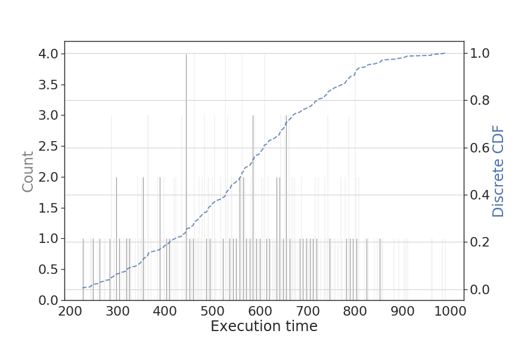

# iSBatch (Batch Scheduler Interface)

iSBatch is a python package that generates resource requests for an application to be used when submitting it on an HPC cluster. *Currently node hours is the only supported resource.*

iSBatch requires past execution times for an application (it is recommanded to have at least 10 runs) as well as basic informaion on the HPC cluster and generates a sequence of requests to be used when submitting on the cluster (if the first request is an under-estimation of the real execution time, the second request should be used and so on)

**Table of contents**
- [Brief theory behind the generated requests](#theory)
- [Usage](#usage)
- [Papers describing internal algorithms](#papers)
- [Code documentation](./docs/README.md)

## Theory

iSBach is computing the optimal request time for a stochastic application based on historic information about previous runs. The following theorem is used to compute the sequence of requests: 


Different alpha, beta, gamma values can be chosen to model large-scale systems. We use:
 - **alpha=1, beta=0, gamma=0** to model the Cloud cost model (*pay for what you reserve*)
 - **alpha=1, beta>=1, gamma=0** for the HPC cost model (*pay for what you reserve* - wait time in the queue - *plus for what you use* - node hours).

The HPC model is chosen by detault.

## Usage

To use this code for generating walltime requests, include:
- `import iSBatch`

Simple examples on how to use the modules in the library are shown in the jupyter lab file and in the `generate_sequence.py` file. Running this file on an input log (like the ones provided as examples in the `log_examples` folder) will return the execution time you need to use for submission on an HPC system described by the default parameters.

```bash
user:~/iSBatch$ python get_sequence.py log_examples/CT_eye_segmentation.log
Request sequence: [(80802.0,), (99019.0,)]

```
To create your own scripts use the following steps:

### 1. Prepare the data

Create a list with historical resource usage information (this list can contain values in any time unit you want the requests to be; note that isBatch does not work with fractions of time unit). 

For our example, `history` will be a list of walltimes for past runs. Create a ResourceEstimator object with the historical data (and optionally the interpolation method to be used or the checkpointing strategy)

```python
wf = iSBatch.ResourceEstimator(history)

wf = iSBatch.ResourceEstimator(history,
                               interpolation_model=iSBatch.DistInterpolation,
                               CR_strategy=iSBatch.CRStrategy.AdaptiveCheckpoint)
```

If you wish to print the CDF of this data, the discrete data (e.g. unique walltimes) and the associated CDF values for each data can be extracted using the `_get_cdf()` function:

```python3
optimal_data, optimal_cdf = wf._get_cdf()
```


*Example discrete CDF and data (without using interpolation) - vertical blue lines represent the recommended request times*

### 2. Compute the sequence of requests

The `compute_request_sequence` function returns the recommended sequence of requests given a historical data. Optionally, the function takes the cost model for the cluster (if none is provided the default HPC model is chosen). For more information about cost models, please inspect the documentation [here](./docs/README.md)

```python
sequence = wf.compute_request_sequence()
```
For large historic datasets, computing the distribution using the discrete data will give good results. Otherwise, interpolation is needed. 


*Example discrete vs interpolation CDF and sequences*

A larger discussion about interpreting the CDF figures can be found in the documentation [here](./docs/README.md)

### 3. [Optional] Compute the cost of a sequence of requests for new data

Compute the cost of a given sequence on new data can be computed using the `compute_sequence_cost` function. The cost represents the average response time of each submission. This time represents all the failed reservation together with the sucessful one. For example, for two submissions one of 10 and another of 15 hours, the cost of the sequence [8, 11, 16] is the average between `8 + 10` (the first submission will fail when requesting 8hs and will succeed the second time) and `8 + 11 + 15` (the second submission fails twice).

```python
cost = wf.compute_sequence_cost(sequence, new_data)
```

## Papers


If you use the resources available here in your work, please cite one of our papers:

For details about how to compute the optimal sequence of requests, please consult our paper: <br/>
**Reservation and Checkpointing Strategies for Stochastic Jobs** <br/>
Ana Gainaru, Brice Goglin, Valentin Honoré, Guillaume Pallez, Padma
Raghavan, Yves Robert, Hongyang Sun.
[IPDPS 2020] (Paper: [INRIA technical report](https://hal.inria.fr/hal-02328013/document))

For details about why interpolation is needed when the historic information is low read our paper: <br/>
**Making Speculative Scheduling Robust to Incomplete Data**<br/>
Ana Gainaru, Guillaume Pallez. 
[SCALA@SC 2019] (Paper: [INRIA technical report](https://hal.inria.fr/hal-02158598/document))<br/>


For details on how to adapt the sequence of requests when backfilling is being used: <br/>
**Speculative Scheduling Techniques for Stochastic HPC Applications**<br/>
Ana Gainaru, Guillaume Pallez, Hongyang Sun, Padma Raghavan [ICPP 2019] (Paper: [INRIA technical report](https://hal.inria.fr/hal-02158598/document))


