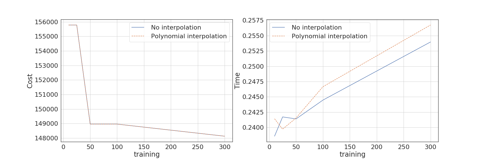
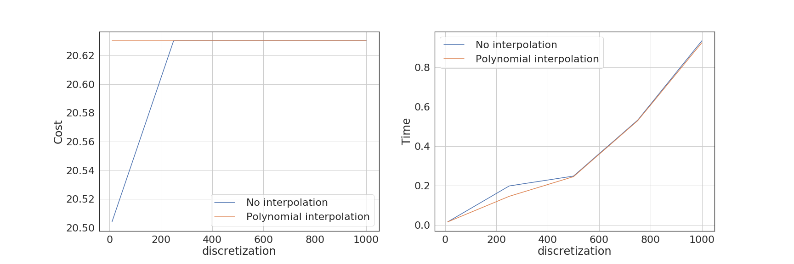
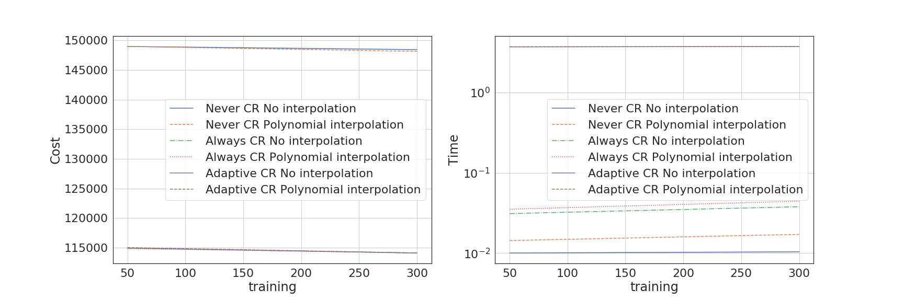

# iSBatch (Batch Scheduler Interface)


## Benchmarking

Script testing the performance of iSBatch under different configurations

### Running the benchmark

The script is using `pytest` with the `pytest-benchmark` plugin.

**Usage:** pytest benchmark.py --benchmark-min-rounds=10 [--benchmark-json=output.json]

Output: Performance results are outputed to the screen or in the json file. Performance and cost results are stored in the metrics.perf file.

### Tests implemented

The tests measure the performance and cost changes for different parameters:

1. The size of the training history for the discrete and polynomial interpolations
    - Default discretization level of 500, no checkpointing

2. The discretization level for the discrete and polynomial interpolations
    - Default history size of 100 elements, no checkpointing


3. The size of the training history for different checkpointing models for the discrete and polynomial interpolations
   - Default discretization of 100 time intervals

### Example output


```
> pytest benchmark.py -k training
==================================================================== test session starts ====================================================================
platform linux -- Python 3.5.2, pytest-5.4.1, py-1.8.1, pluggy-0.13.1
benchmark: 3.2.3 (defaults: timer=time.perf_counter disable_gc=False min_rounds=5 min_time=0.000005 max_time=1.0 calibration_precision=10 warmup=False warmup_iterations=100000)
rootdir: /home/anagainaru/work/scheduler_simulator/github/iSBatch/benchmarks
plugins: benchmark-3.2.3, pylama-7.6.6
collected 32 items / 10 deselected / 22 selected 

benchmark.py .

-------------------------------------------------------------------------------------------------------------- benchmark: 22 tests --------------------------------------------------------------------------------------------------------------
Name (time in us)                                 Min                       Max                      Mean                 StdDev                    Median                     IQR            Outliers         OPS            Rounds  Iterations
------------------------------------------------------------------------------------------------------------------------------------------------------------------------------------------------------------------------------------------------
test_history_length_discrete[10]             147.2729 (1.0)            643.8110 (1.0)            154.8855 (1.0)          18.2469 (1.0)            152.2769 (1.0)            2.4418 (1.0)       141;330  6,456.3837 (1.0)        4943           1
test_history_length_default[100]           8,889.7140 (60.36)       11,366.9271 (17.66)        9,164.0897 (59.17)       351.1234 (19.24)        9,095.8080 (59.73)        100.3583 (41.10)        6;12    109.1216 (0.02)        103           1
test_history_length_discrete[100]          8,906.8620 (60.48)       11,533.8940 (17.92)        9,221.7559 (59.54)       365.0181 (20.00)        9,151.1120 (60.10)        157.8791 (64.66)         6;8    108.4392 (0.02)        106           1
test_history_length_default[1000]        908,562.8641 (>1000.0)    965,318.1500 (>1000.0)    917,717.1179 (>1000.0)  16,901.0903 (926.25)     913,482.7980 (>1000.0)    4,112.3522 (>1000.0)       1;1      1.0897 (0.00)         10           1
test_history_length_discrete[1000]       908,635.7000 (>1000.0)    931,209.1660 (>1000.0)    913,333.6261 (>1000.0)   6,671.2031 (365.61)     911,278.9205 (>1000.0)    3,591.2330 (>1000.0)       1;1      1.0949 (0.00)         10           1
test_history_length_default[10]        1,390,630.5981 (>1000.0)  1,560,813.0051 (>1000.0)  1,448,031.2091 (>1000.0)  67,467.2979 (>1000.0)  1,409,196.1335 (>1000.0)  123,016.6639 (>1000.0)       3;0      0.6906 (0.00)         10           1

```

## Results

The neuroscience.in log is being used to compute the cost and walltime for each scenario. In all test scenarios, the first x elements in the log are used to extract the sequence of walltime requests (with x from 10 to the total size of the log, namely 300 entries). Using the entire log for training will give the optimal cost value (since all the data is used).

**Test 1** For the default parameters, using less historic information leads to higher cost values for the sequence (worse sequences) but lower computational times. For this log there is little to no difference between using interpolation or not.



**Test 2** The discretization level gives the granularity of the sequence. Finer granularity give better sequences but are making the process more computational intensive, for both polynomial and discrete interpolation. Polynomial interpolation gives better sequences when using small training sets.



**Test 3** The sequences that are not using checkpoint have a 30% higher cost than using Checkpointing but can be computed much faster. Polynomial interpolation is always more expensive than the discrete one. Adaptive checkpointing has a complexity of (N^3) compared to (N^2) for the rest but give the best sequences.



Detail look at the difference between Adaptive and Always Checkpoint:


