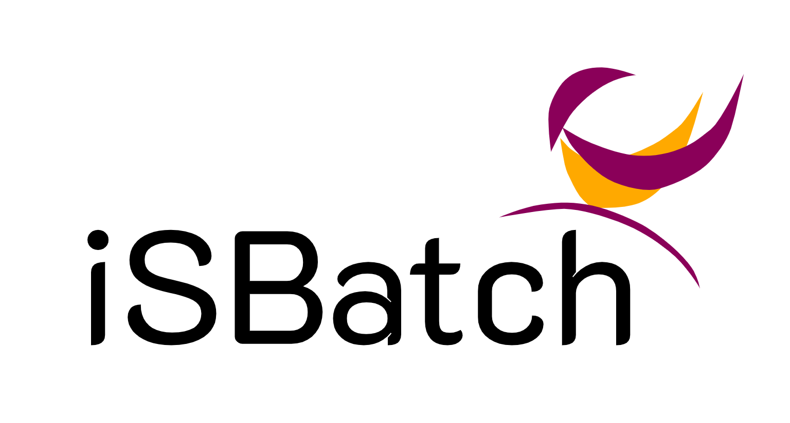

# Documentation

iSBatch is a python package that generates resource requests for an application that can be used when submitting on an HPC cluster. This document presents the API and main features of the tool.

## API

The following image presents an overview of the classes used by the simulator (orange rectangles identify the main objects needed to start using iSBatch; dark red rectangles represent optional or internal objects).


The main class of the project is the **ResourceEstimator**. It takes information about the application:
 - A list of past execution runs
 - The checkpointing strategy (one of the options defined by the Checkpoint/Restart Strategy class)
 
 ```python
    def __init__(self, past_runs, interpolation_model=None,
                 CR_strategy=CRStrategy.NeverCheckpoint, verbose=False):
```
 
 Once an object has been instantiate for a given application, the CR strategy or the default interpoltion methods can be changed.
 
